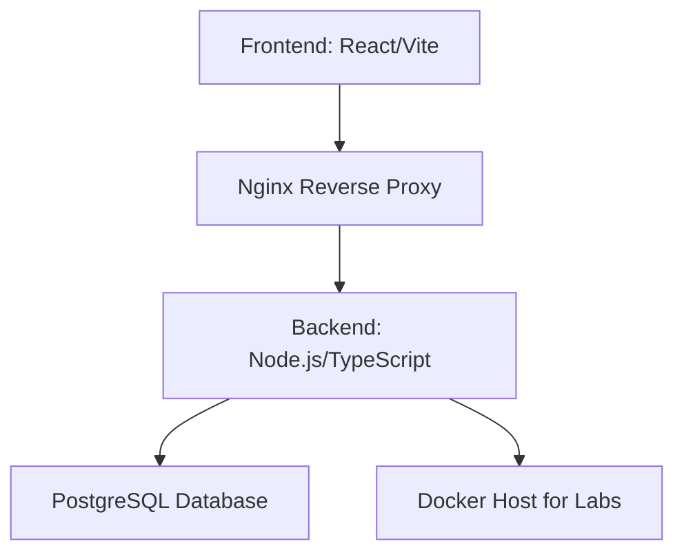
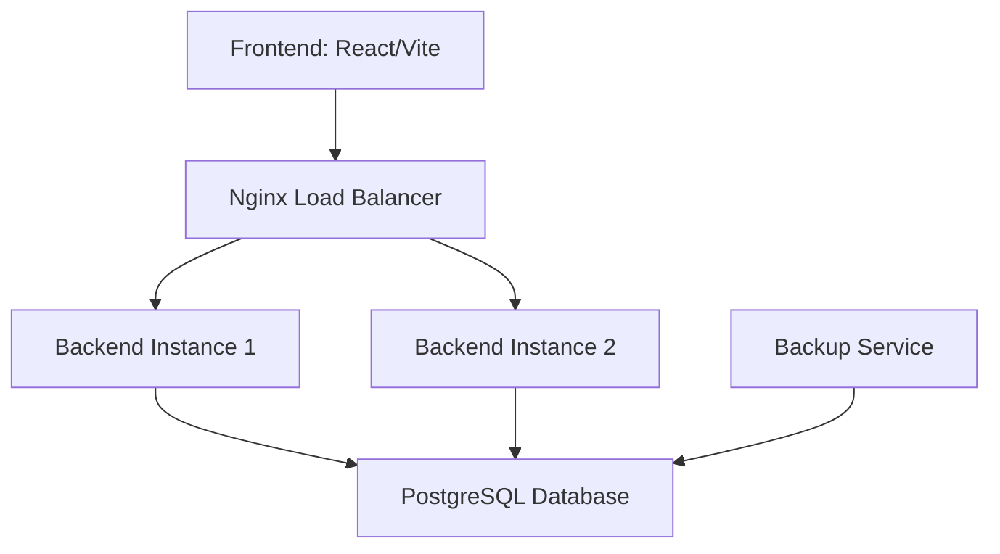

# Infrastructure Improvements Plan for LETHCON

## Overview
The current infrastructure consists of a Docker Compose setup with frontend, backend, PostgreSQL database, and Nginx reverse proxy. Improvements will focus on monitoring, security, scalability, backups, and deployment automation.

## Current Architecture

## Improved Architecture

## Key Improvements
1. **Scalability**: Implement horizontal scaling with multiple backend instances behind Nginx load balancer.
2. **Backups**: Automated database backups with retention policies.
3. **Security**: SSL/TLS certificates, security hardening, secrets management.

## Implementation Steps
- Analyze current infrastructure components and dependencies
- Design improved architecture including monitoring stack and scalability features
- Implement monitoring with Prometheus and Grafana
- Set up automated database backups
- Configure SSL/TLS certificates and security hardening
- Add load balancing and horizontal scaling capabilities
- Establish CI/CD pipeline for automated deployments
- Update documentation with new infrastructure details

This plan provides a roadmap for enhancing the platform's reliability, performance, and maintainability.